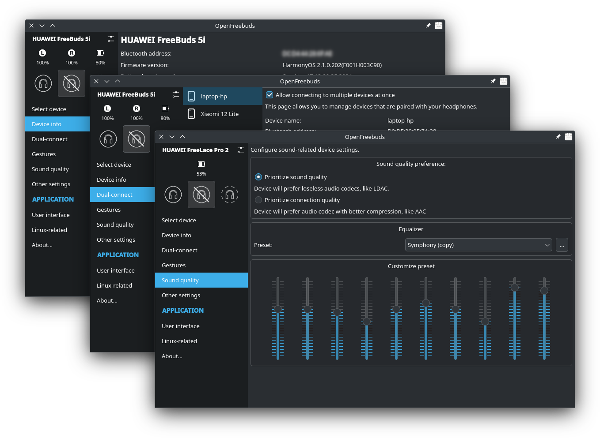

** 🚧🚧🚧 This `next` branch  isn't ready for everyday use. **

That's an absolutely new OpenFreebuds implementation, rewritten
from scratch to asyncio & Qt6. Currently it's still in progress
and a lot of features are missing, and only supported device
is FreeBuds 5i. Stay turned, in some day this version will 
become main.

If you want to test, do this at your own risk:

```shell
poetry install
poetry run pyuic6 openfreebuds_qt/designer
poetry run python -m openfreebuds_qt -v
```

Don't send bugreports, I know that it's absolutely broken.
But, at least, it should show a tray icon and main window
in Win10-11 or KDE.

---


<div align="center">

<h1>OpenFreebuds</h1>
<p>Desktop application to manage wireless headphones from HUAWEI/Honor</p>
<p>


</p>
<p>
<a href="https://mmk.pw/en/openfreebuds"><b>💿 Download binaries</b></a> | <a href="https://crowdin.com/project/openfreebuds">🌍 Suggest translation</a>
</p>
</div>


Features
---------

- Dynamic system tray icon that shows current active noise cancellation mode and battery level;
- Tray menu with battery levels and active noise cancellation settings;
- Ability to change voice language for some models (4i, 5i);
- Device settings dialog, eg. change equalizer preset, gesture actions, etc;
- Built-in HTTP-server for remote control & scripting;
- Built-in global hotkeys support (for Windows and Xorg-Linux)



Device compatability
------------------------

See device page to get information about supported features.
If your device isn't listed here, you could try to use it with profile for other model.

- [HUAWEI FreeBuds 4i](./docs/devices/HUAWEI_FreeBuds_4i.md)
  - **HONOR Earbuds 2** is same
- [HUAWEI FreeBuds 5i](./docs/devices/HUAWEI_FreeBuds_5i.md)
- [HUAWEI FreeBuds Pro](./docs/devices/HUAWEI_FreeBuds_Pro.md)
- [HUAWEI FreeBuds Pro 2](./docs/devices/HUAWEI_FreeBuds_Pro_2.md)
- [HUAWEI FreeBuds Pro 3](./docs/devices/HUAWEI_FreeBuds_Pro_3.md)
- [HUAWEI FreeBuds SE](./docs/devices/HUAWEI_FreeBuds_SE.md)
- [HUAWEI FreeLace Pro](./docs/devices/HUAWEI_FreeLace_Pro.md)
- [HUAWEI FreeLace Pro 2](./docs/devices/HUAWEI_FreeLace_Pro_2.md)

If you want to get full support of your headphones, you can [create a Bluetooth-traffic](https://mmk.pw/en/posts/ofb-contribution/)
dump from Ai Life, which will contain all requests and responses that is used by official
app to manage your headset. Then send collected file to me, I'll analyze them and try to
implement their features in OpenFreebuds.

Download & install
-------------

Build from sources and prey.

TODO: Write this guides


