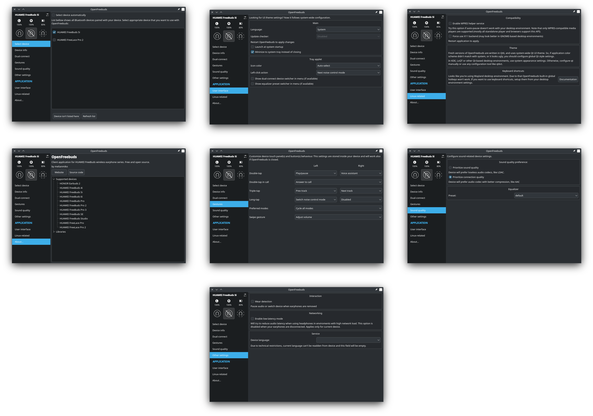

<div align="center">

<h1>OpenFreebuds</h1>
<p>Desktop application to manage wireless headphones from HUAWEI/Honor</p>
<p>


<a href="https://github.com/melianmiko/OpenFreebuds/actions/workflows/on_push.yml">

</a>
</p>
<p>
<a href="https://mmk.pw/en/openfreebuds"><b>💿 Download binaries</b></a> | <a href="https://mmk.pw/en/openfreebuds/help/"><b>❓ FAQ</b></a>
</p>
<p>

</p>
</div>

This application allows to control HUAWEI FreeBuds earphone settings from PC. Check exact battery level, toggle noise cancellation, control built-in equalizer, change gestures, and all other in-device settings and features are now available without official mobile application.

Features
---------

- Dynamic system tray icon that shows current active noise cancellation mode and battery level;
- Tray menu with battery levels and active noise cancellation settings;
- Ability to change voice language (not all devices supported);
- Device settings dialog, eg. change equalizer preset, gesture actions, etc;
- Built-in HTTP-server for remote control & scripting;
- Built-in global hotkeys support (for Windows and Xorg-Linux)


Device compatibility
------------------------

See device page to get information about supported features.
If your device isn't listed here, you could try to use it with profile for other model.

- [HUAWEI FreeBuds 4i](./docs/devices/HUAWEI_FreeBuds_4i.md)
  - **HONOR Earbuds 2 / 2 SE / 2 Lite** is same
- [HUAWEI FreeBuds 5i](./docs/devices/HUAWEI_FreeBuds_5i.md)
- [HUAWEI FreeBuds 6i](./docs/devices/HUAWEI_FreeBuds_6i.md)
- [HUAWEI FreeBuds Pro](./docs/devices/HUAWEI_FreeBuds_Pro.md)
- [HUAWEI FreeBuds Pro 2](./docs/devices/HUAWEI_FreeBuds_Pro_2.md)
- [HUAWEI FreeBuds Pro 3](./docs/devices/HUAWEI_FreeBuds_Pro_3.md)
- [HUAWEI FreeBuds SE](./docs/devices/HUAWEI_FreeBuds_SE.md)
- [HUAWEI FreeBuds Studio](./docs/devices/HUAWEI_FreeBuds_Studio.md)
- [HUAWEI FreeLace Pro](./docs/devices/HUAWEI_FreeLace_Pro.md)
- [HUAWEI FreeLace Pro 2](./docs/devices/HUAWEI_FreeLace_Pro_2.md)

May also work with newer/older devices in same series. If you want to get better compatibility of some model, you could [create Bluetooth traffic dump](https://mmk.pw/en/posts/ofb-contribution/) to help making OpenFreebuds better.

Download & install
-----------------

[](https://mmk.pw/en/openfreebuds/)
[](https://flathub.org/apps/pw.mmk.OpenFreebuds)


#### Debian/Ubuntu

```shell
curl -s https://deb.mmk.pw/setup | sudo bash -
sudo apt install openfreebuds
```

#### Arch Linux

`openfreebuds` [available in AUR](https://aur.archlinux.org/packages/openfreebuds).

#### Test builds

Most recent `dev`-binaries can be found in [GitHub Actions](https://github.com/melianmiko/OpenFreebuds/actions/workflows/on_push.yml) build artifacts.

Build or start from sources
-------------

Requirements:

- Windows 10/11, or enough modern Linux;
- Qt 6.0+ development tools, at least Linguist's `lrelease`;
- [Python](https://www.python.org/downloads/) (3.11+), [Poetry](https://python-poetry.org/docs/#installation) (1.8+);
- (Windows, optional) [NSIS](https://nsis.sourceforge.io/Download), [UPX](https://upx.github.io/);
- (Linux, optional) Build essentials and some libraries.

Also, some dev-scripts may have their own requirements, like `python3-polib` for
`./scripts/sync_translations.sh`. Setup poetry env and dependencies before 
continue:

```shell
poetry install
```

### Just launch without installation

```shell
./scripts/make.py build_launch
```

### Windows

If everything above is installed & added to `PATH`, just run:

```shell
.\scripts\build_win32\make.cmd
```

Output binaries will be located in `scripts\build_win32\dist`

### Debian/Ubuntu

Install all packaging dependencies automated way:
`apt install build-essentials && ./scripts/install_dpkg_dependencies.sh`.

```shell
dpkg-buildpackage -b
```

Output file will be located in parent folder (`../*.deb`).


