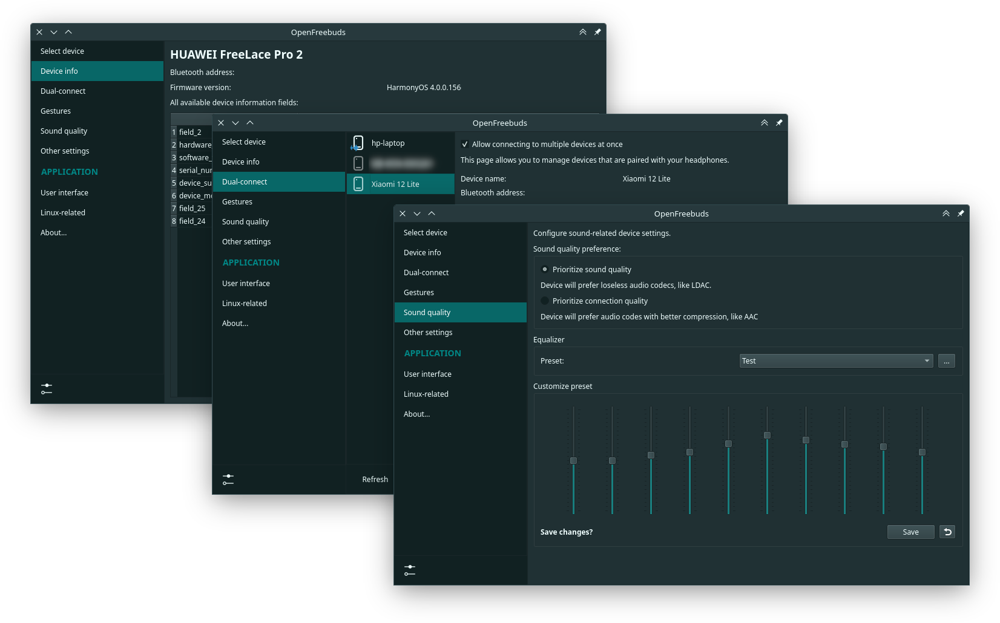
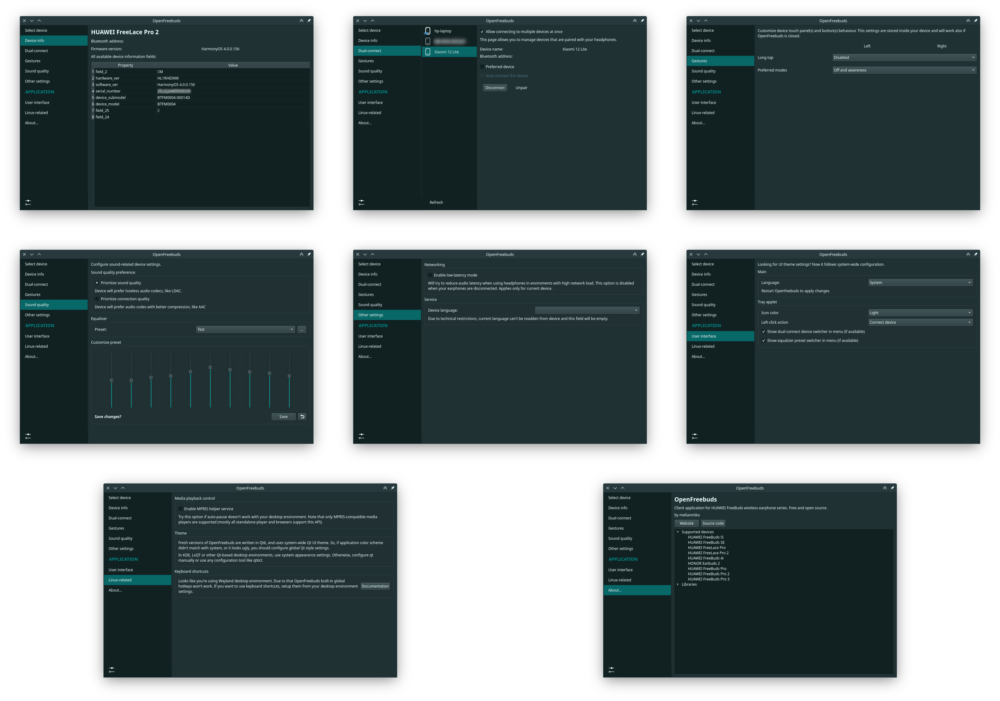

<div align="center">

<h1>OpenFreebuds</h1>
<p>在 PC 上管理华为/Honor 无线耳机的桌面应用</p>
<p>


<a href="https://github.com/melianmiko/OpenFreebuds/actions/workflows/on_push.yml">

</a>
</p>
<p>
<a href="https://mmk.pw/en/openfreebuds"><b>💿 下载安装包</b></a> | <a href="https://mmk.pw/en/openfreebuds/help/"><b>❓ 常见问题</b></a>
</p>
<p>

</p>
</div>

OpenFreebuds 让你在 PC 上直接控制华为 FreeBuds 等无线耳机的各项设置。查看精确电量、切换降噪模式、调节内置均衡器、更改手势操作——无需安装手机应用即可在电脑上完成所有设备内设置。

功能特点
---------

- 动态系统托盘图标，实时显示降噪模式和电量状态；
- 托盘菜单显示电量和降噪设置快捷入口；
- 支持更改语音语言（部分设备）；
- 设备设置面板，可调节均衡器预设、手势动作等；
- 内置 HTTP 服务器，支持远程控制和脚本自动化；
- 内置全局热键支持（Windows 和 Xorg-Linux）



设备兼容性
------------------------

各设备的详细功能支持请参见对应的设备页面。
如果你的设备不在列表中，可以尝试使用其他型号的配置文件。

- [HUAWEI FreeBuds 4i](./docs/devices/HUAWEI_FreeBuds_4i.md)
  - **HONOR Earbuds 2 / 2 SE / 2 Lite** 通用
- [HUAWEI FreeBuds 5i](./docs/devices/HUAWEI_FreeBuds_5i.md)
- [HUAWEI FreeBuds 6i](./docs/devices/HUAWEI_FreeBuds_6i.md)
- [HUAWEI FreeBuds Pro](./docs/devices/HUAWEI_FreeBuds_Pro.md)
- [HUAWEI FreeBuds Pro 2](./docs/devices/HUAWEI_FreeBuds_Pro_2.md)
- [HUAWEI FreeBuds Pro 3](./docs/devices/HUAWEI_FreeBuds_Pro_3.md)
  - **HUAWEI FreeBuds Pro 4** 通用
- [HUAWEI FreeBuds SE](./docs/devices/HUAWEI_FreeBuds_SE.md)
- [HUAWEI FreeBuds SE 2](./docs/devices/HUAWEI_FreeBuds_SE_2.md)
- [HUAWEI FreeBuds SE 4 ANC](./docs/devices/HUAWEI_FreeBuds_SE_4.md)
- [HUAWEI FreeBuds Studio](./docs/devices/HUAWEI_FreeBuds_Studio.md)
- [HUAWEI FreeClip](./docs/devices/HUAWEI_FreeClip.md)
- [HUAWEI FreeClip 2](./docs/devices/HUAWEI_FreeClip_2.md)
- [HUAWEI FreeLace Pro](./docs/devices/HUAWEI_FreeLace_Pro.md)
- [HUAWEI FreeLace Pro 2](./docs/devices/HUAWEI_FreeLace_Pro_2.md)

较新或较旧的同系列设备也可能正常工作。如果你希望改善某个型号的兼容性，可以[抓取蓝牙通信数据](https://mmk.pw/en/posts/ofb-contribution/)来帮助改进 OpenFreebuds。

下载与安装
-----------------

通用安装方式：

[](https://mmk.pw/en/openfreebuds/download/)
[](https://flathub.org/apps/pw.mmk.OpenFreebuds)

完整安装选项：

| 平台                                       | 包管理器                                                                                  | 命令 / 链接                                                                                  |
|--------------------------------------------|------------------------------------------------------------------------------------------|---------------------------------------------------------------------------------------------|
|  Windows        | 直接安装                                                                                 | [官网](https://mmk.pw/en/openfreebuds/download) 或 [Releases](./releases)                   |
|  Windows¹       | [Winget](https://learn.microsoft.com/zh-cn/windows/package-manager/winget/)（系统内置）   | <pre>winget install MelianMiko.OpenFreebuds</pre>                                            |
|  Windows¹       | [Scoop](https://scoop.sh/)                                                               | <pre>scoop bucket add extras<br/>scoop install openfreebuds</pre>                           |
|  Any linux      | [Flathub 可用](https://flathub.org/apps/pw.mmk.OpenFreebuds)                             | <pre>flatpak install pw.mmk.OpenFreebuds</pre>                                               |
|  Debian/Ubuntu | APT                                                                                      | <pre>curl -s https://deb.mmk.pw/setup \| sudo bash -<br/>sudo apt install openfreebuds</pre> |
|  ArchLinux       | [Yay](https://github.com/Jguer/yay) (AUR)                                                | <pre>yay -S openfreebuds</pre>                                                               |
|  NixOS¹ 25.11+    | NixPkgs                                                                                  | [openfreebuds](https://search.nixos.org/packages?channel=unstable&query=openfreebuds)        |

最新的开发版（`dev`）构建可在 [GitHub Actions](https://github.com/melianmiko/OpenFreebuds/actions/workflows/on_push.yml) 的构建产物中找到。

> ¹社区维护

从源码构建
-------------

### 手动构建

环境要求：

- Windows 10/11 或更新的 Linux 发行版；
- Qt 6.0+ 开发工具，至少需要 Linguist 的 `lrelease`（Windows 下会自动从 `PySide6` 获取）；
- [Just](https://github.com/casey/just)
- [Python](https://www.python.org/downloads/) (3.11+)，[PDM](https://pdm-project.org/en/latest/)；
- （Windows，可选）[NSIS](https://nsis.sourceforge.io/Download)，[UPX](https://upx.github.io/)；
- （Debian/Ubuntu，可选）Debian 打包需要一些原生库（命令：`just deps_debian`）。

<details>
<summary>Windows 全部依赖安装</summary>
<pre>
winget install -e --no-upgrade --id Casey.Just
winget install -e --no-upgrade --id NSIS.NSIS
winget install -e --no-upgrade --id UPX.UPX
winget install -e --no-upgrade --id Python.Python.3.12
powershell -ExecutionPolicy ByPass -c "irm https://pdm-project.org/install-pdm.py | python -"
# 仅 Python 3.13+ 需要：
# winget install -e --no-upgrade --id Microsoft.VisualStudio.2022.BuildTools --override "--passive --wait --add Microsoft.VisualStudio.Workload.VCTools;includeRecommended"
</pre>
</details>

安装完上述依赖后，运行以下命令准备项目环境并构建 Python wheel：

```
just prepare build
```

然后可以通过 `just start` 启动 OpenFreebuds，或选择以下打包方式：

- `just win32` — Windows 便携版和安装程序；
- `just debian` — Debian `deb` 包；
- `just flatpak` — Flatpak 包（同时会自动安装应用）。

### 基于 VM 的构建（Vagrant）

> [!WARNING]
> 此构建方法需要至少 16 GB 内存和较快的互联网连接。

安装 [Vagrant](https://developer.hashicorp.com/vagrant/install?product_intent=vagrant) 和合适的虚拟机管理程序（如 VMware），然后在项目根目录执行 `vagrant up`，它会自动部署 Debian 12 和 Windows 11 虚拟机来打包 OpenFreebuds 的各种安装包。

构建完成后记得执行 `vagrant halt` 释放 CPU/内存资源。

---


